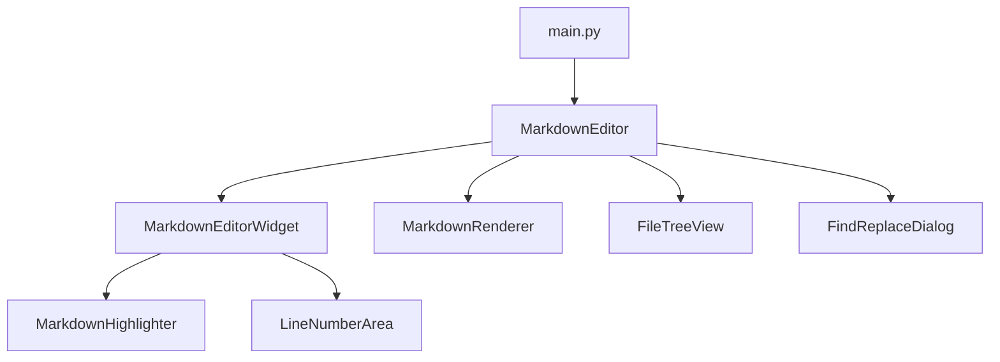

 # Markdown Editor - Документация

## 1. Структура проекта

```
markdown-editor/
├── main.py                # Основной файл приложения
└── Markdown_Editor.ico    # Иконка приложения
```

При работе с приложением также создаются:

```
markdown-editor/
├── images/               # Папка для сохранения вставленных изображений
└── settings.ini          # Файл настроек (создается автоматически)
```

## 2. Описание файлов

### main.py

**Назначение**: Основной файл приложения, содержащий всю логику редактора Markdown.

**Ключевые классы**:

- `MarkdownEditor` - главное окно приложения
- `MarkdownEditorWidget` - виджет редактора с подсветкой синтаксиса и нумерацией строк
- `MarkdownHighlighter` - подсветка синтаксиса Markdown
- `MarkdownRenderer` - рендеринг Markdown в HTML для предпросмотра
- `FindReplaceDialog` - диалог поиска и замены
- `FileTreeView` - дерево файлов для навигации по проекту
- `LineNumberArea` - область с номерами строк

**Краткое объяснение логики**:
Приложение использует архитектуру MVC (Model-View-Controller), где:
- Model: текстовые данные в редакторе и файловая система
- View: интерфейс пользователя (редактор, превью, дерево файлов)
- Controller: обработчики событий, связывающие пользовательские действия с изменениями в модели и представлении

### Markdown_Editor.ico

**Назначение**: Иконка приложения, используемая в заголовке окна и диалогах.

## 3. Архитектура проекта

### Общая структура



### Потоки данных

1. **Редактирование текста**:
   - Пользователь вводит Markdown-текст в `MarkdownEditorWidget`
   - `MarkdownHighlighter` подсвечивает синтаксис в реальном времени
   - Сигнал `textChanged` вызывает `update_preview()`
   - `MarkdownRenderer` преобразует Markdown в HTML
   - HTML отображается в панели предпросмотра

2. **Работа с файлами**:
   - Пользователь открывает/сохраняет файлы через меню или дерево файлов
   - `FileTreeView` отображает структуру файлов и папок
   - Файлы загружаются/сохраняются в текстовом формате UTF-8

3. **Экспорт**:
   - Markdown-текст преобразуется в HTML/PDF/DOCX
   - Результат сохраняется в выбранном пользователем месте

## 4. Библиотеки/фреймворки

| Библиотека | Назначение | Где используется |
|------------|------------|------------------|
| PyQt6 | Основной GUI-фреймворк | Весь интерфейс приложения |
| markdown | Базовый рендеринг Markdown | Запасной вариант рендеринга |
| markdown-it-py | Продвинутый рендеринг Markdown | Основной рендеринг, если доступен |
| pygments | Подсветка синтаксиса в блоках кода | В рендеринге блоков кода |
| python-docx | Экспорт в DOCX | В функции `export_docx()` |
| re | Регулярные выражения | Базовый рендеринг, обработка текста |
| datetime | Работа с датой и временем | Именование файлов изображений |

## 5. Точка входа и запуск

Приложение запускается через функцию `main()` в файле `main.py`:

```python
def main():
    app = QApplication(sys.argv)
    apply_modern_dark_theme(app)
    window = MarkdownEditor()
    window.show()
    sys.exit(app.exec())

if __name__ == "__main__":
    main()
```

Последовательность запуска:
1. Создание экземпляра `QApplication`
2. Применение темной темы через `apply_modern_dark_theme()`
3. Создание главного окна `MarkdownEditor`
4. Отображение окна
5. Запуск цикла событий приложения

## 6. Архитектурные особенности

### Нестандартные решения

1. **Единый файл вместо модульной структуры**
   - Весь код находится в одном файле `main.py`
   - Преимущество: простота распространения и установки
   - Недостаток: затрудняет поддержку при росте проекта

2. **Встроенная подсветка синтаксиса**
   - Вместо использования готовых компонентов реализована собственная подсветка
   - Позволяет тонко настроить стиль под конкретные нужды Markdown

3. **Двойной рендеринг Markdown**
   - Основной: через markdown-it-py (если доступен)
   - Запасной: через встроенный парсер на регулярных выражениях
   - Обеспечивает работу даже без установки дополнительных зависимостей

4. **Автоматическое завершение скобок и тегов**
   - Реализация через перехват событий клавиатуры
   - Подсветка парных скобок и тегов

### Причины выбора архитектуры

1. **PyQt6 как фреймворк**
   - Кроссплатформенность
   - Богатый набор виджетов
   - Поддержка современного внешнего вида
   - Высокая производительность

2. **Разделение редактора и превью**
   - Позволяет видеть исходный код и результат одновременно
   - Можно переключаться между режимами (только редактор/только превью)

3. **Встроенное дерево файлов**
   - Удобная навигация по проекту
   - Возможность работы с несколькими файлами

4. **Поддержка горячих клавиш**
   - Ускоряет работу опытных пользователей
   - Соответствует стандартам современных редакторов

## 7. Функциональные возможности

### Основные возможности

- Редактирование Markdown с подсветкой синтаксиса
- Предпросмотр в реальном времени
- Работа с файлами (открытие, сохранение, автосохранение)
- Экспорт в HTML, PDF, DOCX
- Поиск и замена текста
- Навигация по файловой системе

### Расширенные возможности

- Автоматическое завершение скобок, кавычек, Markdown-тегов
- Подсветка парных скобок и тегов
- Горячие клавиши для форматирования
- Вставка изображений из буфера обмена
- Темная тема с современным дизайном
- Настраиваемый интерфейс (размеры панелей, видимость дерева файлов)

## 8. Требования и установка

### Минимальные требования

- Python 3.6+
- PyQt6

### Рекомендуемые зависимости

- markdown-it-py и pygments (для улучшенного рендеринга)
- python-docx (для экспорта в DOCX)

### Установка

```bash
# Установка основных зависимостей
pip install PyQt6 markdown

# Установка рекомендуемых зависимостей
pip install markdown-it-py pygments python-docx
```

### Запуск

```bash
python main.py
```
